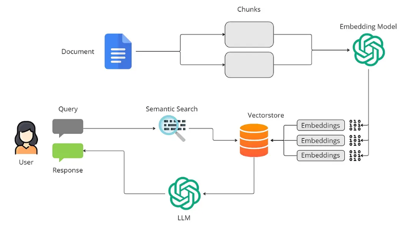

# Inventec NA Website (NABD)

React website + Node API, with an optional FastAPI RAG assistant for Developer documentation.

## What’s in this repo

- **Frontend**: (port **3000**)
- **Backend API**: (port **3001**)
- **RAG service**: (port **8765**)

## Key features

- **Role-based access**: admin / customer / guest
- **Login / register**: users stored in a JSON file (`server/database/users.json`)
- **Admin permission page**: manage roles and users
- **Developer QA Service**: technical question chatbox

---

## Deployment

### Docker

Bring up the web + server + RAG:

CPU (No Nvidia GPU):

```bash
docker compose --profile rag-cpu up -d --build rag-cpu
```

GPU (requires [NVIDIA Container Toolkit](https://docs.nvidia.com/datacenter/cloud-native/container-toolkit/latest/install-guide.html)):

```bash
docker compose --profile rag up -d --build rag
```

---

## Project structure

### RAG Agent (NVIDIA + LangChain/LangGraph + FAISS)

- **Local (On-prem)**: embedding + vector search + reranking (Hugging Face models run with PyTorch, GPU if available)
- **Remote (Cloud)**: LLM generation via **NVIDIA AI Endpoints** (NIM-hosted model accessed through `ChatNVIDIA`)

---

### Technologies used

- **PyTorch (`torch`)**: runs embedding + reranker models on **CUDA GPU** (or CPU fallback)
- **Hugging Face Transformers**: `AutoTokenizer`, `AutoModel`, `AutoModelForSequenceClassification`
  - Uses `trust_remote_code=True` for NVIDIA model implementations from the Hub
- **LangChain**
  - **Docs & loading**: `Document`, `DirectoryLoader`, `TextLoader`
  - **Chunking**: `RecursiveCharacterTextSplitter`
  - **Vector store**: `langchain_community.vectorstores.FAISS`
  - **Retriever tool wrapper**: `create_retriever_tool`
  - **Retriever composition**: `ContextualCompressionRetriever`
- **FAISS**: similarity search index for dense vectors
- **LangGraph**: agent orchestration via `create_react_agent` (ReAct-style tool use)
- **NVIDIA AI Endpoints**: hosted LLM inference via `langchain_nvidia_ai_endpoints.ChatNVIDIA`

---

### Models

- **Embedding model (local, HF)**: `nvidia/llama-3.2-nv-embedqa-1b-v2`
- **Reranker model (local, HF)**: `nvidia/llama-3.2-nv-rerankqa-1b-v2`
- **LLM (remote, NVIDIA AI Endpoints)**: `nvidia/nvidia-nemotron-nano-9b-v2`

> The embedding code follows the model’s expected **prefix convention**:
> - documents are embedded as `passage: ...`
> - queries are embedded as `query: ...`

---

### Workflow 1 — Data prep / indexing (build the knowledge base)

Goal: convert your raw files into a **FAISS vector index** you can retrieve from.

#### Steps

1. **Load source text**
   - From `DATA_DIR` using `DirectoryLoader + TextLoader`
2. **Wrap content in LangChain `Document`**
   - `Document(page_content=..., metadata={"source": ...})`
3. **Chunking (LangChain splitters)**
   - `RecursiveCharacterTextSplitter(chunk_size=800, chunk_overlap=120)`
4. **Embedding (dense vectors)**
   - Run local HF embedding model (nvidia/llama-3.2-nv-embedqa-1b-v2) to produce normalized vectors (dimension ~2048 for this model family).
5. **Build FAISS index**
   - `FAISS.from_documents(chunks, embeddings)` creates an in-memory index.

---

### Workflow 2 — RAG pipeline (answering a user question)

Goal: answer a question using **retrieved context** from the FAISS index, then generate a response with a hosted LLM.

#### Steps

1. **User question**
2. **Query embedding (local)**
   - Convert the user question into an embedding vector using the embedding model (nvidia/llama-3.2-nv-embedqa-1b-v2).
3. **Vector search (FAISS)**
   - Retrieve top-\(k\) candidate chunks by similarity (use `k=6`).
4. **Reranking (local)**
   - Score each candidate chunk with a reranker model (nvidia/llama-3.2-nv-rerankqa-1b-v2) and keep the best few (use `top_k=3`).
5. **Send to NVIDIA endpoint LLM**
   - The agent sends the question + selected context chunks to the remote model (`ChatNVIDIA`).
6. **Output**
   - LLM returns the final answer, guided by the system prompt (Guardrails) (“be grounded, say when you don’t know”).

### Diagram



### How the agent connects retrieval + LLM (LangGraph ReAct)

- Tool name: `company_llc_it_knowledge_base`
- Built from: `create_retriever_tool(retriever=...)`

Then it creates a ReAct-style agent:

- `create_react_agent(model=ChatNVIDIA(...), tools=[retriever_tool], prompt=SYSTEM_PROMPT)`

At runtime, the agent can:
- decide to call the retrieval tool,
- receive retrieved context as tool output,
- produce a grounded final answer.

---

### Inputs you need to run it

- **NVIDIA API key**: required for the hosted LLM call (`NVIDIA_API_KEY`)
- **Internet access**: required to download HF models and call NVIDIA endpoints
- **GPU (optional but recommended)**: speeds up local embedding + reranking

